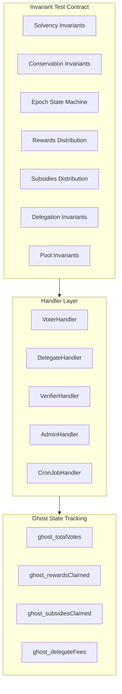

# VotingController Invariant Testing Suite

## Architecture Overview




## File Structure

```javascript
test/5. VotingController/invariant_testing/
├── InvariantHarness.sol          # Base harness with real contracts
├── handlers/
│   ├── VoterHandler.sol          # Personal + delegated voting actions
│   ├── DelegateHandler.sol       # Delegate registration/fee management
│   ├── ClaimsHandler.sol         # Reward/subsidy/fee claims
│   ├── EpochHandler.sol          # Epoch lifecycle + time warping
│   └── AdminHandler.sol          # Pool creation/removal, admin setters
├── VC_Invariants.t.sol           # Core invariant test contract
└── InvariantTests.md             # Documentation
```


## Core Invariants to Test

### 1. Solvency Invariants (Critical)

| ID | Invariant | Strictness | Edge Cases ||----|-----------|------------|------------|| S1 | `esMoca.balanceOf(VC) >= TOTAL_REWARDS_DEPOSITED - TOTAL_REWARDS_CLAIMED + TOTAL_SUBSIDIES_DEPOSITED - TOTAL_SUBSIDIES_CLAIMED` | Strict equality after finalization | Force finalization zeroes allocations || S2 | `address(VC).balance >= TOTAL_REGISTRATION_FEES_COLLECTED - TOTAL_REGISTRATION_FEES_CLAIMED` | Strict equality | Native MOCA may convert to wMOCA on transfer failure || S3 | For each finalized epoch: `epochPtr.totalRewardsClaimed <= epochPtr.totalRewardsAllocated` | Strict | Rounding in claims || S4 | For each finalized epoch: `epochPtr.totalSubsidiesClaimed <= epochPtr.totalSubsidiesAllocated` | Strict | Verifier blocking reduces claimable |

### 2. Vote Conservation Invariants

| ID | Invariant | Strictness | Edge Cases ||----|-----------|------------|------------|| V1 | For each epoch, pool: `epochPools[e][p].totalVotes == sum(usersEpochPoolData[e][p][u].totalVotesSpent) + sum(delegatesEpochPoolData[e][p][d].totalVotesSpent)` | Strict | Vote migration || V2 | For each user: `usersEpochData[e][u].totalVotesSpent == sum(usersEpochPoolData[e][p][u].totalVotesSpent)` across all pools | Strict | Multiple vote calls || V3 | For each delegate: `delegateEpochData[e][d].totalVotesSpent == sum(delegatesEpochPoolData[e][p][d].totalVotesSpent) `| Strict | Migration || V4 | User cannot spend more votes than `veMoca.balanceAtEpochEnd(user, epoch, false)` | Strict | VP decay || V5 | Delegate cannot spend more than `veMoca.balanceAtEpochEnd(delegate, epoch, true)` | Strict | Delegator changes |

### 3. Reward Distribution Invariants

| ID | Invariant | Strictness | Edge Cases ||----|-----------|------------|------------|| R1 | `TOTAL_REWARDS_CLAIMED <= TOTAL_REWARDS_DEPOSITED` | Strict | Unclaimed withdrawal || R2 | Per pool: `poolEpoch.totalRewardsClaimed <= poolEpoch.totalRewardsAllocated` | Strict | Rounding || R3 | Personal rewards: `claimable = (userVotes * poolRewards) / poolVotes` - verify exact math | Approximate (1 wei) | Division rounding || R4 | Delegated rewards: `userGross = (userDelegatedVP * delegatePoolRewards) / delegateTotalVP` | Approximate (1 wei) | Fee calculation || R5 | Fee calculation: `fee = (gross * feePct) / PRECISION_BASE`, `net = gross - fee` | Approximate (1 wei) | Zero fee edge case || R6 | Double-claim prevention: `usersEpochPoolData[e][p][u].totalRewards > 0` blocks re-claim | Strict | Partial claims |

### 4. Subsidy Distribution Invariants

| ID | Invariant | Strictness | Edge Cases ||----|-----------|------------|------------|| SUB1 | `TOTAL_SUBSIDIES_CLAIMED <= TOTAL_SUBSIDIES_DEPOSITED` | Strict | Blocked verifiers || SUB2 | Per pool: `poolEpoch.totalSubsidiesClaimed <= poolEpoch.totalSubsidiesAllocated` | Strict | Ratio calculation || SUB3 | Blocked verifiers have `verifierEpochData[e][v].isBlocked == true` and cannot claim | Strict | Mid-claim blocking || SUB4 | `verifierEpochPoolSubsidies[e][p][v] > 0` prevents double-claim | Strict | Multi-pool claims |

### 5. Epoch State Machine Invariants

| ID | Invariant | Strictness | Edge Cases ||----|-----------|------------|------------|| E1 | State transitions: `Voting -> Ended -> Verified -> Processed -> Finalized` | Strict | Force finalization bypass || E2 | `CURRENT_EPOCH_TO_FINALIZE` only increments on finalization | Strict | Skip finalization || E3 | Finalized epochs have `state >= Finalized (4)` | Strict | ForceFinalized = 5 || E4 | Claims only allowed when `epoch.state == Finalized` (not ForceFinalized) | Strict | Force finalize blocks claims || E5 | `epoch.totalActivePools` is snapshot at endEpoch() | Strict | Pool removal post-end || E6 | `epoch.poolsProcessed == epoch.totalActivePools` for Processed state | Strict | Partial processing |

### 6. Delegation Invariants

| ID | Invariant | Strictness | Edge Cases ||----|-----------|------------|------------|| D1 | Registered delegates have `delegates[d].isRegistered == true` | Strict | Unregistration || D2 | `delegateHistoricalFeePcts[d][e] > 0 `only after delegate votes in epoch e | Conditional | Fee = 0 allowed || D3 | Fee increase delay: `nextFeePctEpoch >= currentEpoch + FEE_INCREASE_DELAY_EPOCHS` | Strict | Immediate decrease || D4 | `delegates[d].currentFeePct <= MAX_DELEGATE_FEE_PCT` | Strict | Admin change || D5 | Sum of delegate fees + delegator net = delegate gross rewards | Strict | Rounding || D6 | Cannot unregister with active votes: `delegateEpochData[e][d].totalVotesSpent == 0` required | Strict | Mid-epoch unregister |

### 7. Pool Invariants

| ID | Invariant | Strictness | Edge Cases ||----|-----------|------------|------------|| P1 | `TOTAL_POOLS_CREATED >= TOTAL_ACTIVE_POOLS` | Strict | Pool removal || P2 | Active pools have `pools[p].isActive == true` | Strict | Removal || P3 | Pool IDs are sequential: 1 to TOTAL_POOLS_CREATED | Strict | No gaps || P4 | Removed pools cannot receive new votes | Strict | Migration FROM allowed || P5 | `pools[p].totalVotes == sum(epochPools[e][p].totalVotes)` across all epochs | Strict | Cross-epoch consistency |

### 8. Withdrawal Invariants

| ID | Invariant | Strictness | Edge Cases ||----|-----------|------------|------------|| W1 | Unclaimed withdrawal only after `UNCLAIMED_DELAY_EPOCHS` | Strict | Delay change || W2 | `epochPtr.totalRewardsWithdrawn + epochPtr.totalRewardsClaimed <= epochPtr.totalRewardsAllocated` | Strict | Partial withdrawal || W3 | Registration fee withdrawal: `TOTAL_REGISTRATION_FEES_CLAIMED <= TOTAL_REGISTRATION_FEES_COLLECTED` | Strict | - |

## Handler Design

### VoterHandler Actions

```solidity
- vote(uint128[] poolIds, uint128[] votes, bool isDelegated)
- migrateVotes(uint128[] srcPoolIds, uint128[] dstPoolIds, uint128[] votes, bool isDelegated)
```


### DelegateHandler Actions

```solidity
- registerAsDelegate(uint128 feePct)
- updateDelegateFee(uint128 newFeePct)
- unregisterAsDelegate()
```


### ClaimsHandler Actions

```solidity
- claimPersonalRewards(uint128 epoch, uint128[] poolIds)
- claimDelegatedRewards(uint128 epoch, address[] delegates, uint128[][] poolIds)
- claimDelegationFees(uint128 epoch, address[] delegators, uint128[][] poolIds)
- claimSubsidies(uint128 epoch, address verifier, uint128[] poolIds)
```


### EpochHandler Actions

```solidity
- endEpoch()
- processVerifierChecks(bool allCleared, address[] verifiers)
- processRewardsAndSubsidies(uint128[] poolIds, uint128[] rewards, uint128[] subsidies)
- finalizeEpoch()
- warpTime(uint256 seconds)
```


### AdminHandler Actions

```solidity
- createPools(uint128 count)
- removePools(uint128[] poolIds)
- forceFinalizeEpoch()
```


## Ghost Variables for Tracking

```solidity
// Vote tracking
mapping(uint128 epoch => mapping(uint128 poolId => uint128)) ghost_poolVotes;
mapping(uint128 epoch => mapping(address user => uint128)) ghost_userVotesSpent;
mapping(uint128 epoch => mapping(address delegate => uint128)) ghost_delegateVotesSpent;

// Reward/subsidy tracking
uint128 ghost_totalRewardsAllocated;
uint128 ghost_totalRewardsClaimed;
uint128 ghost_totalSubsidiesAllocated;
uint128 ghost_totalSubsidiesClaimed;

// Delegation tracking
mapping(address delegate => bool) ghost_isRegistered;
mapping(address delegate => uint128) ghost_currentFeePct;
uint128 ghost_registrationFeesCollected;

// Pool tracking
uint128 ghost_totalPoolsCreated;
uint128 ghost_totalActivePools;
mapping(uint128 poolId => bool) ghost_poolIsActive;

// Epoch state tracking
uint128 ghost_currentEpochToFinalize;
mapping(uint128 epoch => uint8) ghost_epochState;
```


## Implementation Approach

1. **InvariantHarness.sol**: Extends [IntegrationTestHarness.sol](test/5. VotingController/integration_testing/IntegrationTestHarness.sol) to reuse real contract deployment
2. **Handlers**: Use `useActor` modifier pattern from [Handler.sol](test/4. VotingEscrowMoca/Invariant/Handler.sol)
3. **Ghost variables**: Track all state mutations for cross-validation
4. **Actor pool**: 5 voters, 3 delegates, 2 verifiers, rotating via `bound()`

## Key Files to Reference

- [VotingController.sol](src/VotingController.sol) - main contract under test
- [DataTypes.sol](src/libraries/DataTypes.sol) - structs and enums
- [IntegrationTestHarness.sol](test/5. VotingController/integration_testing/IntegrationTestHarness.sol) - base setup with real contracts
- [Handler.sol](test/4. VotingEscrowMoca/Invariant/Handler.sol) - handler pattern reference
- [Invariant.t.sol](test/4. VotingEscrowMoca/Invariant/Invariant.t.sol) - invariant pattern reference

## Implementation Todos

1. Create InvariantHarness extending IntegrationTestHarness
2. Build VoterHandler with vote/migration actions + ghost tracking
3. Build DelegateHandler with registration/fee actions + ghost tracking
4. Build ClaimsHandler with all claim types + ghost tracking
5. Build EpochHandler with lifecycle actions + time warping