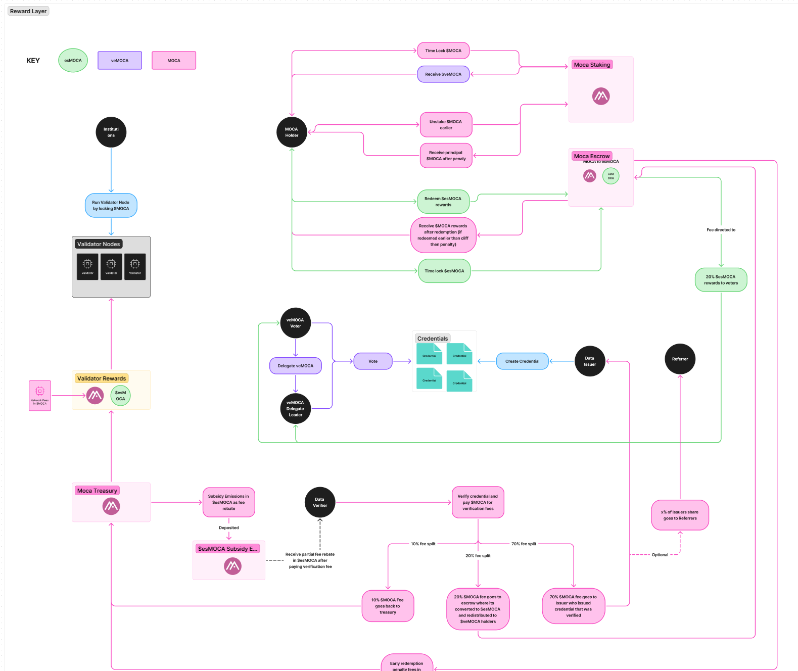

# Outline of Contracts

# Overview

This document outlines the key smart contracts that will be implemented for the Moca Chain staking system. The system consists of three main components:

1. **Validator Staking & Emissions [esMOCA]**
   - Handles node operator staking and rewards
   - Manages validator registration and slashing
   - Distributes validator rewards

2. **Staking Moca and Voting [veMOCA]**
   - Enables users to stake MOCA tokens
   - Manages voting power and delegation
   - Handles staking rewards distribution

3. **AIR Credentials**
   - Manages verifier and referrer credentials
   - Handles credential verification and validation
   - Tracks referral relationships and rewards

Each component is designed to work together to create a secure and efficient staking ecosystem while maintaining proper separation of concerns.

Reference: https://www.notion.so/animocabrands/WIP-Moca-Chain-Staking-Product-1fb3f5ceb8fe80c5b0fbc2b372c9a325

# 1. Validator Staking & Emissions

## Overview

The validator staking system balances network security with sustainable token emissions through:

- Optimized emissions that maintain >10% APR for validators after node costs
- Permissioned validator model with infrastructure partner support
- Strong alignment incentives through $veMOCA governance
- Flexible redemption options for emissions rewards

Whitelisted actors can stake MOCA for a defined period to operate a validator node.
For running said node, they receive vested rewards, esMOCA.

> Note: After the initial 18-24-month period, the network may transition to permissionless validator onboarding, delegated proof of staking

## Key Components

### Validator Whitelisting & Requirements

**Whitelisting**

- selection is offchain: select entities will be whitelisted as per BD agreements
- translating that onchain: we will whitelist an address

Whitelisted address is allowed to call access controlled functions to stake the required MOCA.

**Node Requirements**

Validators have to stake MOCA for a period to be eligible to run a node:

- Lockup period
- Minimum MOCA requirement

Both should be modifiable.
When updated, the new values would impact incoming validators, not current active validators.

*UNCLEAR*

- how would the whitelisted address go about running an actual node?

### 2. Emissions Structure

- Direct validator emissions in $esMOCA
- Additional emissions from verification fees
- Emissions can be staked for $veMOCA (1:1 conversion with $MOCA)
- Governance power based on $veMOCA holdings

#### 3. Redemption Options
| Option | Lockup Period | Conversion Rate | Penalty |
|--------|---------------|-----------------|---------|
| Standard | 60 days | 100% | None |
| Early | 30 days | 70% | 30% |
| Immediate | 0 days | 25% | 75% |

#### 4. Slashing Conditions
- Malicious behavior results in loss of staked $MOCA
- Minimum stake requirements must be maintained

### Target Participants

1. **Infrastructure Partners**
   - Token loans from Moca Foundation
   - Guaranteed minimum revenue from emissions
   - Additional rewards from network activity
   - Future permissionless validator opportunities

2. **New Investors (OTC)**
   - Discounted token purchases
   - Liquid yield through $esMOCA
   - Option to transfer yield to portfolio companies
   - Flexible redemption options

3. **Existing Investors**
   - Lock existing tokens for 18+ months
   - Earn yield on locked tokens
   - Governance influence through $veMOCA
   - Emissions control through voting power

### Future Considerations
- Transition to permissionless validator onboarding
- Implementation of delegated proof of stake
- Dynamic adjustment of emissions based on network activity
- Enhanced infrastructure partner opportunities

